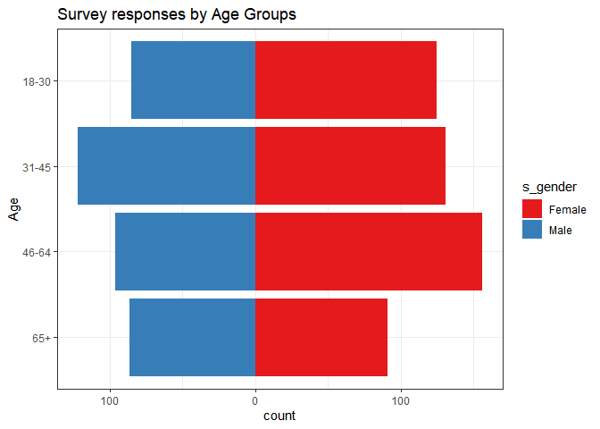

<!-- README.md is generated from README.Rmd. Please edit that file -->
surveyanalysis
==============

<!-- badges: start -->
[](https://github.com/janu123/surveyanalysisR/actions) <!-- badges: end -->

The goal of surveyanalysis is to analyse the market research survey data

What is special about using `README.Rmd` instead of just `README.md`? You can include R chunks like so:

``` r
library(dplyr)
#> 
#> Attaching package: 'dplyr'
#> The following objects are masked from 'package:stats':
#> 
#>     filter, lag
#> The following objects are masked from 'package:base':
#> 
#>     intersect, setdiff, setequal, union
library(surveyanalysisR)
#> Loading required package: conjoint
#> Warning: package 'conjoint' was built under R version 4.0.3
#> Loading required package: ggplot2
#> Loading required package: haven
#> Warning: package 'haven' was built under R version 4.0.3
#> Loading required package: stringr
library(purrr)
library(scales)
#> 
#> Attaching package: 'scales'
#> The following object is masked from 'package:purrr':
#> 
#>     discard
survey_demo<- survey_data %>% select(response_id, d_urban:s_problem, d_marital:weights)
variables_with_labels = map(survey_demo, function(x) attr(x, "class") == "haven_labelled") %>% names()
factored_demo<-survey_demo %>%
  mutate_at(all_of(variables_with_labels), as_factor)
survey1<-factored_demo %>%
  group_by(s_gender,s_age)%>%
  summarise(count=n())
#> `summarise()` regrouping output by 's_gender' (override with `.groups` argument)
ggplot(data=survey1, aes(x=s_age, fill=s_gender)) +scale_fill_brewer(palette="Set1",  na.value = "gray")+
  geom_bar(data=filter(survey1, s_gender=="Female"), aes(y=count), stat="identity") + 
  geom_bar(data=filter(survey1, s_gender=="Male"), aes(y=count*(-1)), stat="identity") +
  scale_y_continuous(breaks=seq(-600, 600, 100), 
                     labels=comma(abs(seq(-600, 600, 100)))) + 
  labs(x="Age", y="count", title="Survey responses by Age Groups") +
  coord_flip() +
  theme_bw()
```


