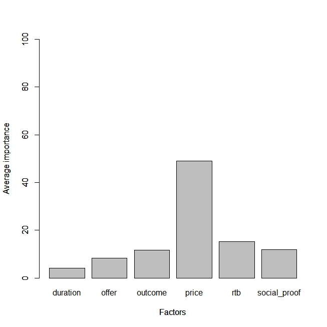

<!-- README.md is generated from README.Rmd. Please edit that file -->
surveyanalysisR
===============

<!-- badges: start -->
[](https://github.com/janu123/surveyanalysisR/actions) <!-- badges: end -->

The goal of surveyanalysisR package is to analyse the market research survey data

The code shows the results of the ratings based conjoint analysis

``` r
library(surveyanalysisR)
lev<-c("12 months","3 months","6 months","give you the energy to unlock your fullest potential","help you lead a better life","help you sleep without more pills",
       "improve your health for the long-run","improve your sleep sustainably","breaking bad habits and creating new routines",
       "changing your sleep mindset","empowering you to take back your sleep habits",
       "$20/month","$30/month","$40/month",
       "a program created just for you","cognitive behavioral therapy","daily text messages from a coach","personalized, human coaching","the support of a community of people just like you","unique daily games, challenges and exercises",
       "a method that has helped thousands","leading researchers","professional athletes","scientific evidence")
lev_df<-data.frame(lev)
conjoint_analysis(conjoint_data[,7],conjoint_data[,1:6],lev_df)
#> 
#> Call:
#> lm(formula = frml)
#> 
#> Residuals:
#>     Min      1Q  Median      3Q     Max 
#> -1.3835 -0.9911 -0.1256  0.9332  2.1910 
#> 
#> Coefficients:
#>                          Estimate Std. Error t value Pr(>|t|)    
#> (Intercept)              2.256916   0.045740  49.342  < 2e-16 ***
#> factor(x$duration)2      0.013239   0.026137   0.507  0.61250    
#> factor(x$duration)3     -0.011302   0.025931  -0.436  0.66296    
#> factor(x$offer)2         0.015367   0.033200   0.463  0.64348    
#> factor(x$offer)3         0.036063   0.033437   1.079  0.28082    
#> factor(x$offer)4         0.050162   0.033230   1.510  0.13119    
#> factor(x$offer)5         0.021909   0.033423   0.656  0.51215    
#> factor(x$outcome)2      -0.033869   0.025915  -1.307  0.19127    
#> factor(x$outcome)3      -0.070029   0.026026  -2.691  0.00714 ** 
#> factor(x$price)2        -0.223568   0.026002  -8.598  < 2e-16 ***
#> factor(x$price)3        -0.296401   0.025942 -11.426  < 2e-16 ***
#> factor(x$rtb)2          -0.013191   0.036142  -0.365  0.71513    
#> factor(x$rtb)3          -0.092402   0.036604  -2.524  0.01161 *  
#> factor(x$rtb)4          -0.017391   0.036577  -0.475  0.63447    
#> factor(x$rtb)5          -0.065366   0.036834  -1.775  0.07599 .  
#> factor(x$rtb)6          -0.057131   0.036701  -1.557  0.11958    
#> factor(x$social_proof)2  0.063220   0.030116   2.099  0.03582 *  
#> factor(x$social_proof)3 -0.002343   0.029915  -0.078  0.93758    
#> factor(x$social_proof)4  0.069323   0.029770   2.329  0.01990 *  
#> ---
#> Signif. codes:  0 '***' 0.001 '**' 0.01 '*' 0.05 '.' 0.1 ' ' 1
#> 
#> Residual standard error: 1.096 on 10685 degrees of freedom
#> Multiple R-squared:  0.01592,    Adjusted R-squared:  0.01426 
#> F-statistic: 9.604 on 18 and 10685 DF,  p-value: < 2.2e-16
#> [1] "Part worths (utilities) of levels (model parameters for whole sample):"
#>                                                  levnms                 utls
#> 1                                             intercept     2.25691572840246
#> 2                                             12 months   0.0132391546483003
#> 3                                              3 months  -0.0113017065085242
#> 4                                              6 months -0.00193744813977612
#> 5  give you the energy to unlock your fullest potential   0.0153666472088024
#> 6                           help you lead a better life   0.0360630872099288
#> 7                     help you sleep without more pills   0.0501618534033698
#> 8                  improve your health for the long-run   0.0219092793527582
#> 9                        improve your sleep sustainably   -0.123500867174859
#> 10        breaking bad habits and creating new routines  -0.0338685399117461
#> 11                          changing your sleep mindset  -0.0700286153939524
#> 12        empowering you to take back your sleep habits    0.103897155305699
#> 13                                            $20/month   -0.223568389317216
#> 14                                            $30/month   -0.296401402533548
#> 15                                            $40/month    0.519969791850764
#> 16                       a program created just for you  -0.0131913521956239
#> 17                         cognitive behavioral therapy  -0.0924016197423456
#> 18                     daily text messages from a coach  -0.0173906041102955
#> 19                         personalized, human coaching  -0.0653661441178639
#> 20   the support of a community of people just like you  -0.0571311953123966
#> 21         unique daily games, challenges and exercises    0.245480915478525
#> 22                   a method that has helped thousands   0.0632196028114564
#> 23                                  leading researchers -0.00234291460113159
#> 24                                professional athletes   0.0693233492410827
#> 25                                  scientific evidence   -0.130200037451407
#> [1] Sum of average importance:  100
#> [1] "Chart of average factors importance"
```


