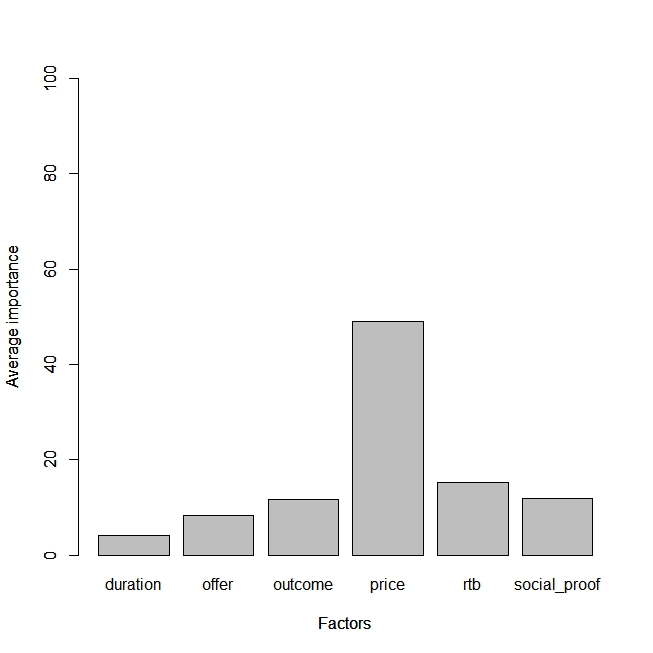
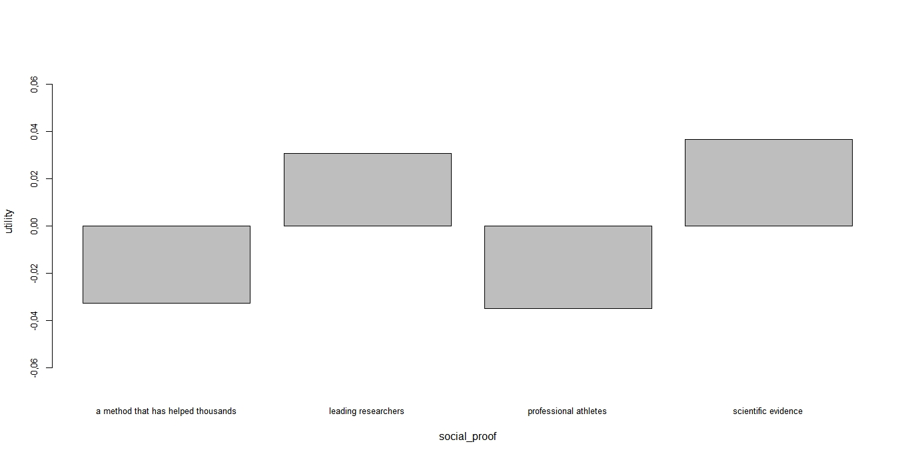

```{r, include = FALSE}
knitr::opts_chunk$set(
  collapse = TRUE,
  comment = "#>"
)
```


```{r setup,message = FALSE,warning=FALSE}
library(surveyanalysisR)
lev<-c("12 months","3 months","6 months","give you the energy to unlock your fullest potential","help you lead a better life","help you sleep without more pills",
       "improve your health for the long-run","improve your sleep sustainably","breaking bad habits and creating new routines",
       "changing your sleep mindset","empowering you to take back your sleep habits",
       "$20/month","$30/month","$40/month",
       "a program created just for you","cognitive behavioral therapy","daily text messages from a coach","personalized, human coaching","the support of a community of people just like you","unique daily games, challenges and exercises",
       "a method that has helped thousands","leading researchers","professional athletes","scientific evidence")
lev_df<-data.frame(lev)
conjoint_analysis(conjoint_data[,7],conjoint_data[,1:6],lev_df)
```

```{r,echo=FALSE}

```

```{r,echo=FALSE,out.width = '100%'}

```

```{r , fig,fig.height = 5, fig.width = 5, message=FALSE, warning=FALSE}
library(surveyanalysisR)
library(scales)
survey<-factored_demo %>%
  group_by(s_gender,s_age)%>%
  summarise(count=n())
ggplot(data=survey, aes(x=s_age, fill=s_gender)) +scale_fill_brewer(palette="Set1",  na.value = "gray")+
  geom_bar(data=filter(survey, s_gender=="Female"), aes(y=count), stat="identity") + 
  geom_bar(data=filter(survey, s_gender=="Male"), aes(y=count*(-1)), stat="identity") +
  scale_y_continuous(breaks=seq(-600, 600, 100), 
                     labels=comma(abs(seq(-600, 600, 100)))) + 
  labs(x="Age", y="count", title="Survey responses by Age Groups") +
  coord_flip() +
  theme_bw()
```

```{r setup,fig1, fig.height = 5, fig.width = 5,message=FALSE,warning=FALSE}
plot_demo("d_urban")
```

```{r,fig2, fig.height = 5, fig.width = 7,message=FALSE,warning=FALSE}
factored_philosophy %>%
  pivot_longer(m1_philosophy_1:m1_philosophy_9, names_to = "question", values_to = "response") %>%
  ggplot(aes(x = response)) +
  geom_bar() +
  facet_wrap(vars(question), ncol = 3) +
  labs(x = "Response (on a 1 to 5 scale)", y = "Number of respondents")+theme(axis.text.x = element_text(angle = 15,hjust = 0.5, size =7))+
  scale_x_discrete(labels = function(x) str_wrap(x, width = 8))
```


```{r,fig3, fig.height = 5, fig.width = 7,message=FALSE,warning=FALSE}
factored_awareness %>%
  pivot_longer(m2_awareness_apps_1:m2_awareness_apps_14, names_to = "question", values_to = "response") %>% filter(response!="NA")%>%
  ggplot(aes(x = response)) +
  geom_bar() +
  labs(x = " ", y = "Number of respondents")+theme(axis.text.x = element_text(angle = 15,hjust = 0.5, size =7))+
  scale_x_discrete(labels = function(x) str_wrap(x, width = 8))
```

```{r,fig4, fig.height = 5, fig.width = 7,message=FALSE,warning=FALSE}
factored_source %>%
  pivot_longer(source_1:source_17, names_to = "question", values_to = "response") %>% filter(response!="NA")%>%
  ggplot(aes(x = response)) +
  geom_bar() +
  labs(x = " ", y = "Number of respondents")+theme(axis.text.x = element_text(angle = 15,hjust = 0.5, size =7))+
  scale_x_discrete(labels = function(x) str_wrap(x, width = 8))
```

